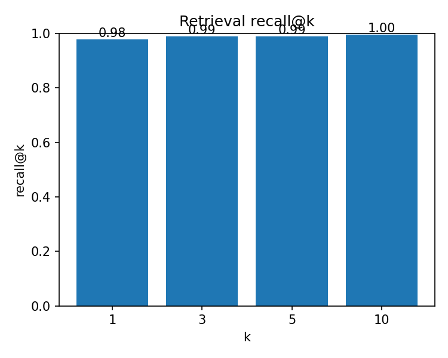
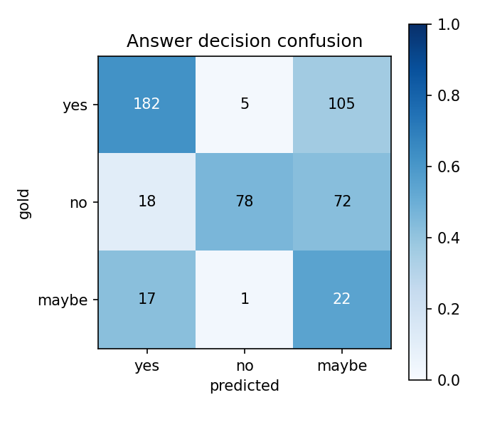

# 의료 논문 기반 RAG 질의응답 (PubMedQA)

의학 연구 초록을 근거로 임상 질문에 yes/no/maybe로 답하는 RAG
(Retrieval-Augmented Generation) 파이프라인입니다. 질문이 들어오면
벡터 검색으로 관련 논문 문단을 찾고, 그 문단만을 근거로 LLM이 판정과
근거를 생성합니다.

의료 AI에서 LLM을 그대로 쓰기 어려운 이유는 환각(hallucination)과
근거 부재입니다. RAG는 "검증된 문서에서 찾은 내용만으로 답하게" 강제해서
이 문제를 완화하는 방식이라, 임상 질의응답의 표준 접근으로 쓰입니다.
이 프로젝트는 그 파이프라인을 처음부터 끝까지 직접 구성하고 정량 평가한
것입니다.

## 데이터셋

- [PubMedQA](https://huggingface.co/datasets/qiaojin/PubMedQA) (pqa_labeled, 전문가 라벨 1,000건)
- 각 질문에는 관련 의학 논문 초록(context)과 yes/no/maybe 정답이 있음
- 모든 초록 문단을 모아 검색 코퍼스로 사용하고, 질문셋은 dev/test로 분할

## 구조

```
├── src/
│   ├── prepare_data.py   # PubMedQA -> 검색 코퍼스 + 질문셋(jsonl)
│   ├── retriever.py      # 임베딩(sentence-transformers) + FAISS/numpy 검색
│   ├── generator.py      # 검색 문단 근거로 판정 생성하는 LLM 래퍼 + RAG 파이프라인
│   └── evaluate.py       # recall@k(검색) + answer accuracy(최종 답변)
├── tools/
│   └── gen_toy_data.py   # 합성 의료 QA (동작 확인용)
├── notebooks/
│   └── pubmedqa_rag_colab.ipynb
└── results/
```

## 실행 방법

```bash
pip install -r requirements.txt
export ANTHROPIC_API_KEY=sk-...            # 생성기로 Claude API 사용 시

python src/prepare_data.py                 # PubMedQA 다운로드 + 전처리
python src/build_index.py                  # (노트북에 통합) 코퍼스 임베딩
python src/evaluate.py --backend st --gen claude --k 5   # 생성기: claude(기본)|hf|echo
```

생성기(`--gen`)는 세 가지를 지원합니다:
`claude`(Anthropic API, 품질 최상·GPU 불필요·공고의 "LLM API"에 해당),
`hf`(무료 오픈모델, GPU 필요), `echo`(LLM 없이 로직 확인용).

의존성/데이터 없이 파이프라인 로직만 확인하려면:

```bash
python tools/gen_toy_data.py
python src/evaluate.py --backend hash --gen echo   # LLM/임베딩 모델 불필요
```

## 접근 방법

**검색 (Retriever)**
- 임베딩은 의료 도메인 문장 임베딩 모델
  (`pritamdeka/S-PubMedBert-MS-MARCO`)을 사용. 일반 도메인 모델보다
  의학 용어에서 검색 품질이 좋음
- 벡터 인덱스는 FAISS(IndexFlatIP), 없는 환경에서는 numpy 코사인으로 폴백.
  임베딩을 L2 정규화해서 내적이 곧 코사인 유사도가 되게 함
- 검색 성능은 recall@k로 측정: 질문과 같은 논문(pubid)의 문단이 top-k
  안에 들어오는 비율

**생성 (Generator)**
- 검색된 문단만 프롬프트에 넣고 "이 근거만으로 yes/no/maybe와 한 줄
  이유를 답하라"고 지시. 근거 밖 지식으로 답하지 않도록 제약
- 생성기를 백엔드 교체형으로 설계: **Claude API(기본)** / 무료 오픈모델
  (Qwen2.5-1.5B) / echo. 같은 RAG 파이프라인에서 생성기만 갈아끼워
  품질·비용을 비교할 수 있게 함
- 실무에서 쓰는 방식인 LLM API(Claude)를 기본으로 하되, GPU만 있으면
  API 없이도 오픈모델로 재현 가능하도록 폴백을 남김
- 생성문에서 판정을 파싱할 때, 형식이 어긋나면 보수적으로 maybe 처리

**평가**
- 검색: recall@1/3/5/10
- 최종 답변: yes/no/maybe 정확도 + confusion matrix

## 결과

test 질문 500건 기준:

| 지표 | 값 |
|---|---|
| Retrieval recall@5 | 0.99|
| Answer accuracy | 0.564 |




- 검색 단계에서 관련 문단을 잘 찾을수록 최종 답변 정확도가 올라가는
  경향을 확인 (근거가 맞아야 판정도 맞음)
- maybe 클래스가 가장 어려움 — 근거가 애매한 경우가 실제로 많고,
  사람 라벨러도 어려워하는 카테고리

## 한계와 다음 단계

- 현재는 단일 검색 → 단일 생성의 기본 RAG. 질문을 하위 질문으로 쪼개
  여러 번 검색하는 **에이전트형(multi-hop) 파이프라인**으로 확장하면
  복잡한 임상 질문에 더 강해질 것
- 검색 모델을 파인튜닝하거나 reranker(cross-encoder)를 얹어 recall 개선
- 실제 임상 현장에서는 EHR/FHIR 같은 구조화 데이터와의 연동, 그리고
  "근거 문서를 함께 제시하는" 신뢰성 요구가 핵심 — 답변에 출처 문단을
  같이 반환하도록 이미 구조는 잡아둠

## 참고자료

- Jin et al., "PubMedQA: A Dataset for Biomedical Research Question
  Answering" (EMNLP 2019)
- Lewis et al., "Retrieval-Augmented Generation for Knowledge-Intensive
  NLP Tasks" (NeurIPS 2020)
